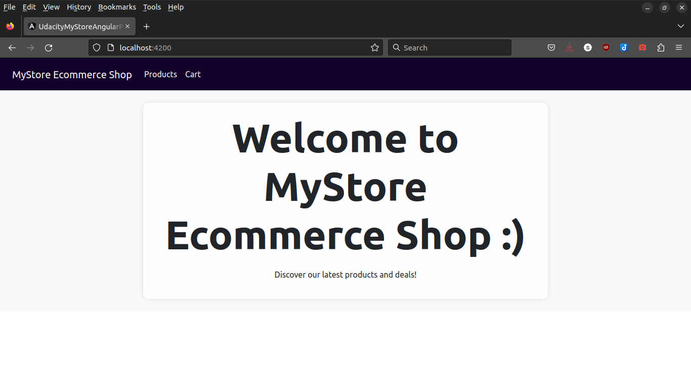
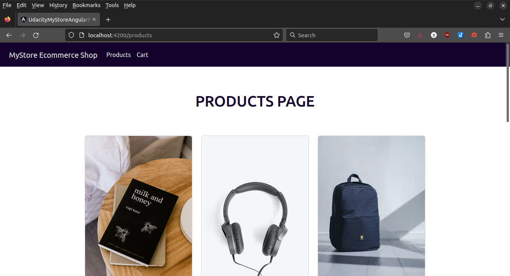
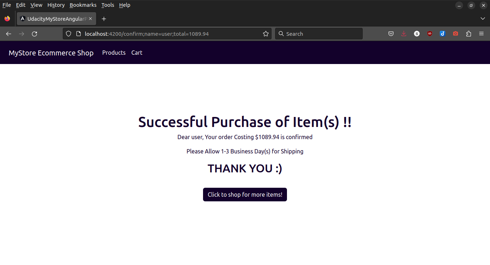

# MyStore Angular Project

This project was generated with [Angular CLI](https://github.com/angular/angular-cli) version 15.1.6.

## Description

This is a web application for an online store that allows users to view and purchase products. The application features a home page, a product list page, a product detail page, and a shopping cart page. Users can add products to their cart, remove items from their cart, and checkout.

## Installation

To run this application on your local machine, follow these steps:

1. Clone the repository
2. Install the dependencies by running `npm install`
3. Start the development server by running `ng serve --port 3000`

## Components

This application consists of the following components:

- Home page

- Product list page

- Product detail page

- Shopping cart page

- Product item component

## Models

This application uses the following models:

- Product model

## Routing

This application uses the Angular Router to navigate between pages.

## Development

To contribute to this project, follow these steps:

1. Fork the repository
2. Create a new branch for your feature or bugfix
3. Make your changes and commit them
4. Push your changes to your forked repository
5. Create a pull request to merge your changes back into the main repository

## Testing

This application includes unit tests and end-to-end tests. To run the tests, follow these steps:

- To run unit tests: `ng test`
- To run end-to-end tests: `ng e2e`

## License

This project is licensed under the MIT License. See the LICENSE.md file for details.

## Authors
-shadrack omondi